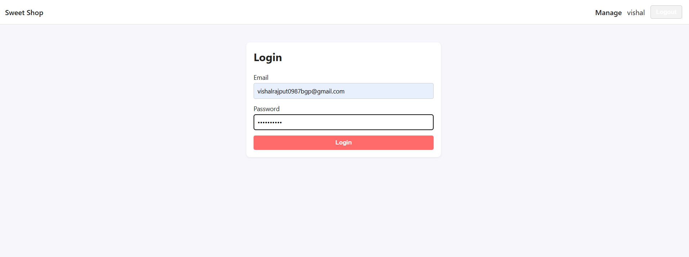
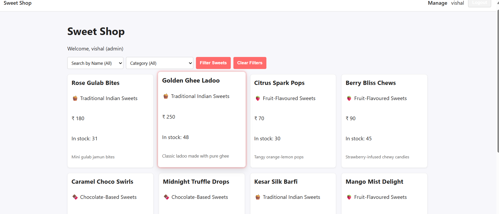
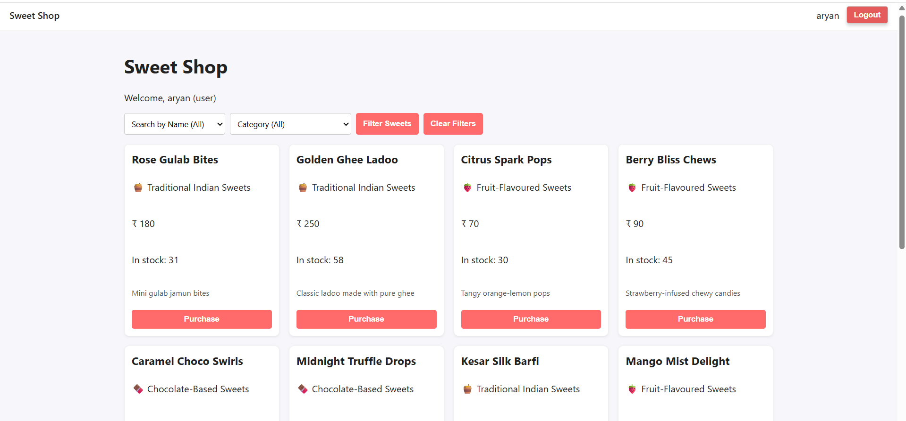
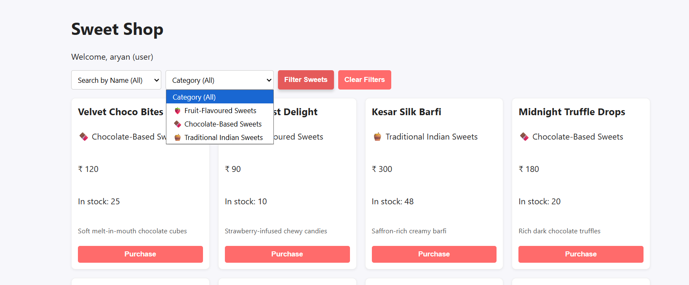
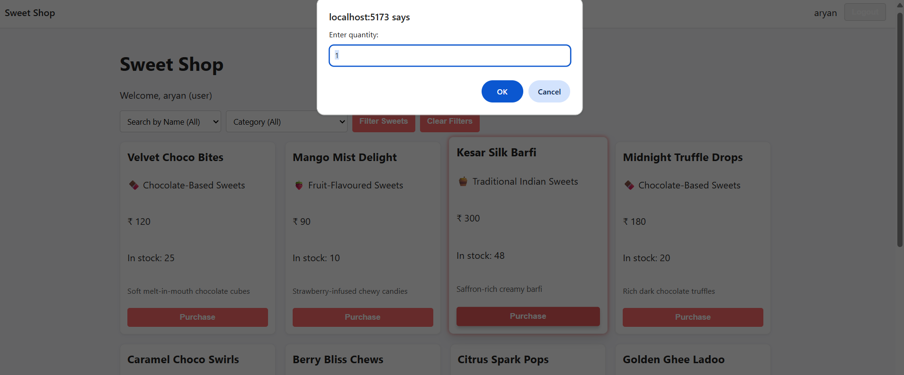
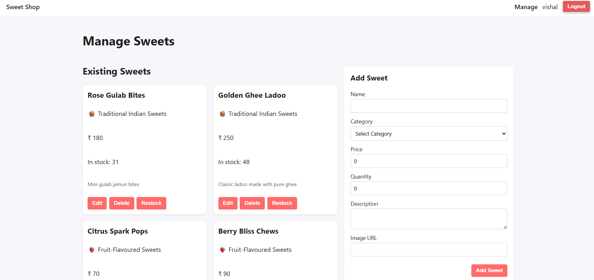
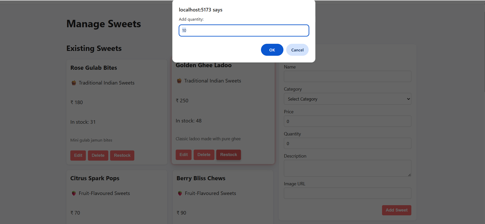

# 🍰 Sweet Shop Management System

## 🌟 Project Overview

This project is a full-stack web application designed for a Sweet Shop to manage its inventory and process customer purchases. Built using the MERN stack (MongoDB, Express, React, Node.js), it provides a clean, responsive interface for customers to browse and purchase available sweets, along with a secure administrative dashboard for managing stock, prices, and product details.

### Key Features Implemented:

User Authentication: Secure registration and login for both `user` and `admin` roles using JWTs.
Product Catalog: Users can view all available sweets with real-time stock and price information.
Filtering & Searching: Users can efficiently filter sweets by **Name** and **Category**.
Secure Purchasing: Users can purchase sweets, which automatically and atomically reduces the stock quantity in the database.
Admin Management:** Administrators can perform complete CRUD (Create, Read, Update, Delete) operations on sweets and initiate stock restock actions.
Dynamic UI:** Interactive card and button hover effects for a modern and engaging user experience.

---

## Setup and Running the Project Locally

Follow these steps to get the application running on your local machine.

### Prerequisites

You must have the following software installed:

Node.js & npm: (Tested with Node v18+)
MongoDB: A running instance (local or Atlas cluster).

### 1. Backend Setup (`backend` directory)

Navigate to the `backend` directory in your terminal.

1.  Install Dependencies:
   
    npm install
    
2.  Create Environment File:
    Create a file named `.env` in the `backend` directory and add your connection strings:
    
    env
    PORT=5000
    MONGODB_URI="your_mongodb_connection_string"
    JWT_SECRET="a_strong_secret_key_for_jwt"
    
3.  Start the Server:
    
    npm start
    
    The server will run on `http://localhost:5000`.

### 2. Frontend Setup (`frontend` directory)

Open a new terminal window and navigate to the `frontend` directory.

1.  Install Dependencies:
    
    npm install
    
2.  Start the Application:
    
    npm run dev
    
    The application will open in your browser, typically at `http://localhost:5173`.

---

## 📸 Screenshots of the Final Application

  

  

  
  
  

  
  

---

## My AI Usage (Mandatory Policy Section)

As per the project requirements, I leveraged the Gemini AI assistant to accelerate development, ensure best practices, and refine complex logic. My usage was transparent, and the AI is co-authored in the commit history where applicable.

### AI Tools Used:

Gemini: (Google's AI Assistant)

### How I Used AI:

Backend Refinement: Used Gemini to debug and finalize the `sweetController.js` logic for conditional sweet filtering (by name and category), ensuring the Mongoose queries were efficient and accurate.
Frontend Logic: Used Gemini to provide the most secure and robust solution for hiding the "Purchase" button from the administrator on all views, leveraging the `user.role` from the authentication context within `SweetCard.jsx`.
UI/UX Enhancement (CSS):Used Gemini to generate and refine the specific CSS transitions, `transform`, and `box-shadow` rules to create the dynamic "pop-out" hover effects on the sweet product cards and primary buttons, significantly improving the application's polish.
Documentation: Used Gemini to structure and ensure the completeness of this `README.md` file and to format Git commit messages with the required co-authorship trailers.

### Reflection on AI Impact:

AI significantly streamlined the workflow in three key areas: complex query construction, cross-cutting UI/logic concerns (like role-based rendering), and aesthetic detailing. By outsourcing boilerplate code and CSS refinement to Gemini, I was able to dedicate more time to securing the API endpoints and validating the core purchasing business logic, leading to a faster development cycle and a high-quality final product.
